# Cyclistic Bike Share Analysis

## Introduction
Cyclistic is a bike-share company based in Chicago. Their bike-share program features over 5,800 bicycles that are geotracked and locked into a network of 692 docking stations across Chicago. Cyclistic's marketing strategy relied on building general awareness and appealing to broad consumer segments. One approach that helped make these things possible was the flexibility of its pricing plans: single-ride passes, full-day passes, and annual memberships. These pricing plans helped the company categorize its customers into two types;

+ Casual Riders: Customers who purchase single-ride or full-day passes
+ Cyclistic Members (Member Riders): Customers who purchase annual memberships

The finance analysts concluded that Member riders are much more profitable than Casual riders and the manager believed that maximizing the number of annual members will be key to future growth. She also believed that rather than creating a marketing campaign that targets all-new customers, there is a very good chance to convert Casual riders into members.

As the data analyst, I was required to identify how member riders and casual riders use cyclistic bikes differently by analyzing historical bike trip data.

## Business Task
The business task of this study was to perform descriptive analysis to spot trends and identify differences between the casual riders and member riders.

## Preparing the Data
The data was made available as CSV files which were zipped according to their respective months. To get the data I needed for my analysis, I retrieved 12 previous months of Cyclistic historical bike data from [here](https://divvy-tripdata.s3.amazonaws.com/index.html). I retrieved data from April 2021 to March 2022 for my analysis.

The data was gathered firsthand by the company on all its users. The data is reliable, organized, comprehensive, current and frequently updated, and cited under an open license.

Data-privacy issues prohibit the use of personally identifiable information of the riders', therefore credit card information was not included in this analysis.

## Tools Used
+ Python: Data cleaning, data transformation, and data analysis
+ Tableau: Data visualization

## Processing the Data
Importing libraries needed for the analysis

    import pandas as pd
    import numpy as np
    import datetime as dt

Loading the historical bike trip data retrieved into dataframes

    jan = pd.read_csv("202201-divvy-tripdata.csv")
    feb = pd.read_csv("202202-divvy-tripdata.csv")
    mar = pd.read_csv("202203-divvy-tripdata.csv")
    apr = pd.read_csv("202104-divvy-tripdata.csv")
    may = pd.read_csv("202105-divvy-tripdata.csv")
    jun = pd.read_csv("202106-divvy-tripdata.csv")
    jul = pd.read_csv("202107-divvy-tripdata.csv")
    aug = pd.read_csv("202108-divvy-tripdata.csv")
    sep = pd.read_csv("202109-divvy-tripdata.csv")
    octo = pd.read_csv("202110-divvy-tripdata.csv")
    nov = pd.read_csv("202111-divvy-tripdata.csv")
    dec = pd.read_csv("202112-divvy-tripdata.csv")

Merging all dataframes into one dataframe

    data_list = [apr, may, jun, jul, aug, sep, octo, nov, dec, jan, feb, mar]
    merged_df = pd.concat(data_list)

To find the length of each ride, I converted the started_at and ended_at columns to datetime objects so I could compute their difference

    merged_df['started_at'] = pd.to_datetime(merged_df['started_at'])
    merged_df['ended_at'] = pd.to_datetime(merged_df   ['ended_at'])
    merged_df['ride_length'] = merged_df['ended_at'] - merged_df['started_at']

To get the day of the week that each ride started

    merged_df["day_of_week"] = merged_df["started_at"].dt.dayofweek

The days are returned as numbers e.g, Monday = 0, Tuesday = 1, and so on. To change it to the days proper, I created a dictionary of the days of the week and wrote a lambda function to apply it to each column

    weekday = {
        0:'Monday',
        1:'Tuesday',
        2:'Wednesday',
        3:'Thursday',
        4:'Friday',
        5:'Saturday',
        6:'Sunday'
    }
    merged_df['day_of_week_name'] = merged_df   ['day_of_week'].apply(lambda x:weekday[x])
    
I created columns for the month and year for each ride from the started_at column

    merged_df['year'] = pd.DatetimeIndex(merged_df['started_at']).year
    merged_df['month'] = pd.DatetimeIndex(merged_df['started_at']).month

## Analyzing the Data
To find out the number of riders per user type

    total_members = merged_df['member_casual'].value_counts()
    total_members

A visualization of this output is shown below

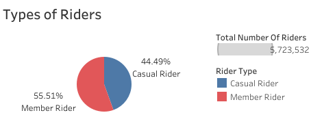

To find out the average duration of a ride for each user type

    casual_member = merged_df[merged_df['member_casual'] == 'casual']
    avg_casual_member_ride_length = casual_member   ['ride_length'].mean()
    avg_casual_member_ride_length

*Average Ride Time for Casual Riders*

    paid_member = merged_df[merged_df['member_casual'] == 'member']
    avg_paid_member_ride_length = paid_member   ['ride_length'].mean()
    avg_paid_member_ride_length

 
*Average Ride Time for Member Riders*

From the outputs, it is obvious that the average duration of a ride for casual riders is higher than that of member riders

To find out the maximum duration of a ride for each user type

    max_casual_member_ride_length = casual_member['ride_length'].max()
    max_casual_member_ride_length

*Maximum Duration of Rides for Casual Riders*

    max_paid_member_ride_length = paid_member['ride_length'].max()
    max_paid_member_ride_length

*Maximum Duration of Rides for Member Riders*

From the outputs, casual riders have a higher maximum ride length than the member riders

To find out the most frequent day of the week that riders ride for each user type

    mode_ride_day_casual_member = casual_member['day_of_week_name'].mode()
    mode_ride_day_casual_member

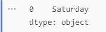
*Most Frequent Ride Day for Casual Riders*

    mode_ride_day_paid_member = paid_member['day_of_week_name'].mode()
    mode_ride_day_paid_member

*Most Frequent Ride Day for Member Riders*

Now let's take a look at the number of rides per day for each user type

    ride_per_day_casual = casual_member.groupby('day_of_week_name')['ride_id'].count().sort_values(ascending=False)
    ride_per_day_casual

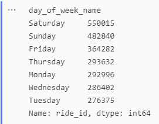
*Number of Rides per Day for Casual Riders*

    ride_per_day_paid = paid_member.groupby('day_of_week_name')['ride_id'].count().sort_values(ascending=False)
    ride_per_day_paid

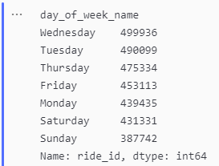
*Number of Rides per Day for Member Riders*

Plotting these outputs against each other;

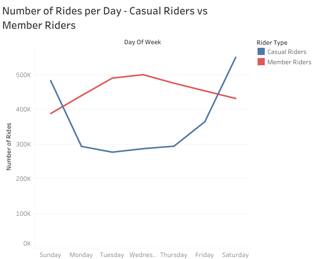

We can see that member riders are more active during weekdays than on weekends while casual riders use the program more often during the weekend than on weekdays.

To find out the average ride length per day for each user type

    avg_casual_length_per_day = casual_member[['day_of_week_name', 'ride_length']]
    avg_casual_length_per_day = avg_casual_length_per_day.groupby('day_of_week_name')['ride_length'].mean()
    
    #Convert above result to dataframe
    avg_casual_length_per_day_df = pd.DataFrame({"day_of_week":avg_casual_length_per_day.index,
                                    "casual_ride_length_avg": avg_casual_length_per_day.values})

    avg_casual_length_per_day_df['casual_ride_length_avg'] = avg_casual_length_per_day_df['casual_ride_length_avg']/pd.Timedelta(minutes=1) #To get ride length in minutes
    avg_casual_length_per_day_df

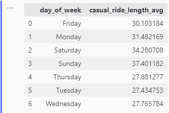
*Average Ride Length per Day for Casual Riders*

    avg_paid_length_per_day = paid_member[['day_of_week_name', 'ride_length']]
    avg_paid_length_per_day =   avg_paid_length_per_day.groupby   ('day_of_week_name')['ride_length'].mean()
    
    avg_paid_length_per_day_df = pd.DataFrame   ({"day_of_week":avg_paid_length_per_day.index,
    "paid_ride_length_avg": avg_paid_length_per_day.values})

    avg_paid_length_per_day_df  ['paid_ride_length_avg'] =    avg_paid_length_per_day_df ['paid_ride_length_avg']/pd.Timedelta(minutes=1) #To get ride length in minutes

    avg_paid_length_per_day_df

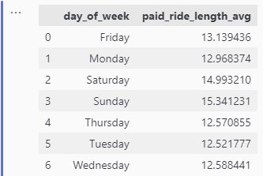
*Average Ride Length per Day for Member Riders*

Plotting these two outputs together;

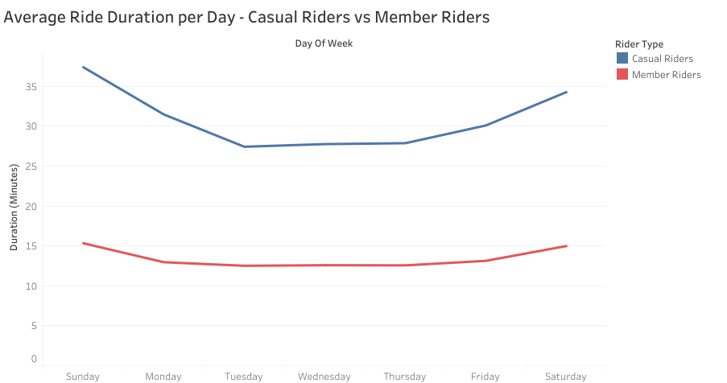

It can be seen that casual riders ride for longer periods per day when compared to member riders and this difference is quite huge.

The plot below shows the types of bikes used by each user type

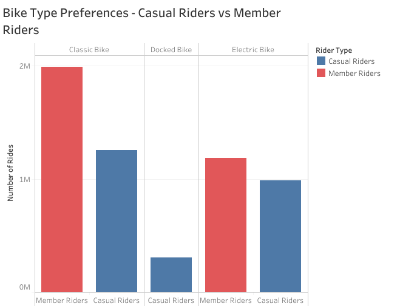

The classic bike is the most preferred type of bike by both user types followed by the electric bike. The docked bike is the least preferred bike type and is not even used by any member rider.

Lastly, we will check for any monthly trends in the data.

    monthly_trend = merged_df.groupby("month")["member_casual"].value_counts()
    monthly_trend_df = monthly_trend.to_frame()
    monthly_trend_df
    #Convert to dataframe then to CSV file
    monthly_trend_df = monthly_trend.unstack(level=1)
    monthly_trend_df

The visualization of the result is shown below

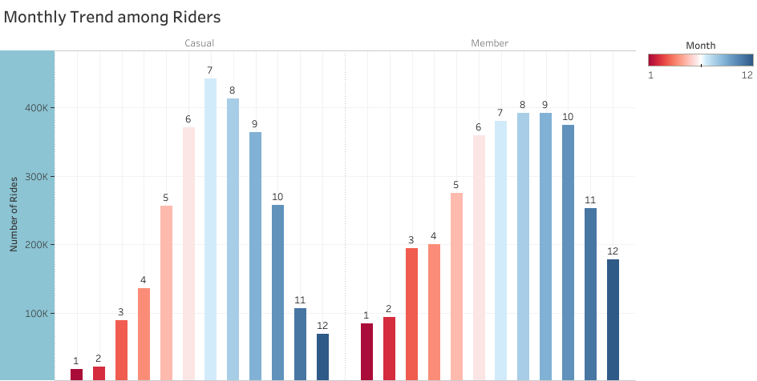

There is a general rise in the use of Cyclistic's program between June to August for both user types. This rise may be a result of vacations or the warm weather that comes with the summer season. It is also worth noting that between the months of September and May, there were more active member riders than casual riders. 30% of Cyclistic users use the program to commute to work and these months normally are active months in most workplaces and schools meaning less vacations and lesser time to ride for leisure and hence the gap between the number of rides among the user types.

The notebook used for my analysis can be found [here](https://github.com/SanniEmmanuel/Cyclistic-Bike-Share-Analysis/blob/main/Cyclistic%20Analysis.ipynb)

The dashboard for these visualizations is shown below and can be found [here](https://public.tableau.com/views/CyclisticBikeShareAnalysisVisualizations-GoogleDataAnalyticsProfessionalCertificate/Dashboard1?:language=en-US&:display_count=n&:origin=viz_share_link)

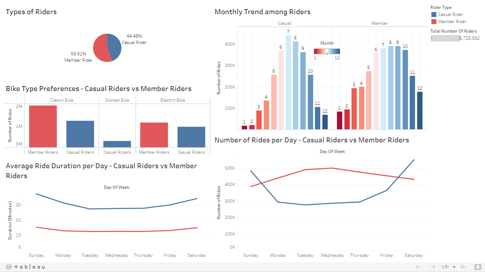

## Recommendations
+ The company should consider reducing the price charged on weekend rides for member riders and make a reasonable price gap between both user types since there are more casual riders active during the weekend. This price gap would attract casual riders and may in turn cause them to convert to members.
+ Discounts could be given to member riders based on ride duration. Since casual riders ride for longer, these discounts can help attract casual riders to purchasing membership subscriptions.
+ There should be heavy incentives and privileges for member riders during the summer season.
+ There could be a discount on the price charged for the docked bike for member riders. Since only casual riders use this bike, it could attract them to converting to member riders.
